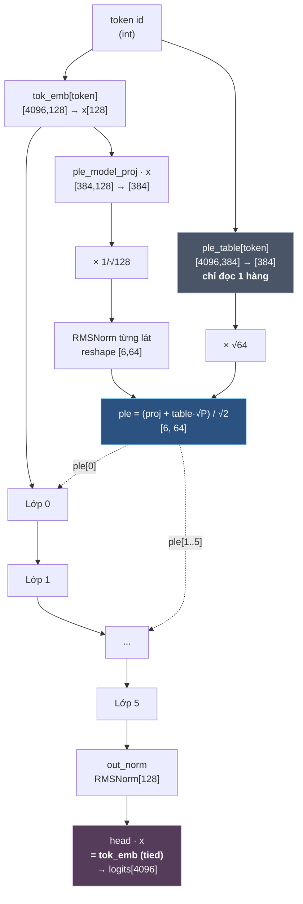
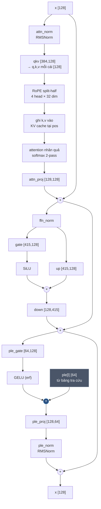
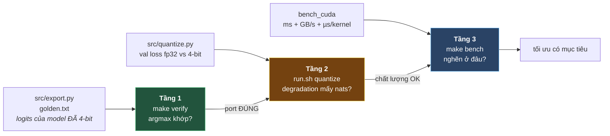

# Kiến trúc model + hướng dẫn deploy và test

Tài liệu đầy đủ: model là gì, chạy pipeline trên laptop ra sao, deploy lên Jetson Orin
Nano Super ra sao, và test thế nào để biết đúng.

Mọi số trong file này **đo thật** ngày 2026-08-01 trên:
- **Laptop**: x86_64, RTX 4060 Laptop 8GB, Docker + nvidia runtime
- **Jetson**: Orin Nano Super Dev Kit 8GB, JetPack 6.2 (L4T R36.4.7), CUDA 12.6

---

# PHẦN I — KIẾN TRÚC MODEL

## 1.1 Tổng thể

Decoder-only transformer + Per-Layer Embeddings (PLE). Cấu hình đã train:

```
vocab_size = 4096     d_model = 128     n_layers = 6
n_heads    = 4        head_dim = 32     ffn_hidden = 415
ple_dim    = 64       seq_len = 512     rope_theta = 10000
```



## 1.2 Bên trong một lớp

Ba nhánh residual nối tiếp. Hai nhánh đầu là transformer chuẩn, nhánh thứ ba là PLE.



**Điểm mấu chốt là dấu `×` ở nhánh PLE**, không phải `+`. Đó là *điều kiện hoá*
(conditioning): cả hai thừa số đều có thể triệt tiêu nhau, nên model học được
"với token này, ở lớp này, đóng nhánh kia lại". Nếu chỉ cộng thì nó chỉ là một bias
theo token, yếu hơn nhiều. Xem [`src/model.py:130-132`](src/model.py#L130-L132).

## 1.3 Bảng tensor đầy đủ

```
                                shape         params    tầng     ghi chú
─────────────────────────────────────────────────────────────────────────────────
tok_emb.weight              [4096, 128]      524,288   stream   tied với head
ple_model_proj.weight        [384, 128]       49,152   core     384 = L×P = 6×64
ple_proj_norm.weight              [64]            64   core     fp32, không quantize
ple_table.weight            [4096, 384]    1,572,864   TABLE    ★ đọc 1 hàng/token
─────────────────────────────────────── ×6 lớp ──────────────────────────────────
  attn_norm.weight               [128]           128   core     fp32
  attn.qkv.weight            [384, 128]        49,152   core     384 = 3×128
  attn.proj.weight           [128, 128]        16,384   core
  ffn_norm.weight                [128]           128   core     fp32
  ffn.gate.weight            [415, 128]        53,120   core
  ffn.up.weight              [415, 128]        53,120   core
  ffn.down.weight            [128, 415]        53,120   core
  ple_gate.weight             [64, 128]         8,192   core
  ple_proj.weight             [128, 64]         8,192   core
  ple_norm.weight                [128]           128   core     fp32, init = 0
                                        ───────────
                            mỗi lớp:       241,664
                            × 6 lớp:     1,449,984
─────────────────────────────────────────────────────────────────────────────────
out_norm.weight                  [128]           128   core     fp32

  core   = 1,499,328   (41.7%)  đọc TOÀN BỘ mỗi token
  stream =   524,288   (14.6%)  quét tuần tự 1 lần/token
  table  = 1,572,864   (43.7%)  ★ chỉ đọc 384 phần tử = 192 B/token
  ─────────────────────────
  TỔNG   = 3,596,480 tham số  →  model.bin 1.87 MB @ 4-bit
```

## 1.4 Ba tầng bộ nhớ — ý tưởng trung tâm

Phân loại theo **cách truy cập**, không theo tốc độ. Xem [`src/budget.py`](src/budget.py).

| Tầng | Truy cập | ESP32-S3 | Jetson |
|---|---|---|---|
| **core** | dày đặc, ngẫu nhiên, mỗi token | SRAM 512KB (khan hiếm) | VRAM/RAM |
| **stream** | dày đặc, quét tuần tự 1 lần/token | PSRAM — tốn *băng thông* | tốn bandwidth |
| **table** | **thưa: 1 hàng/token** | flash mmap | gần như miễn phí |

Con số đo được của bảng PLE (`bench_cuda` in ra):

```
bảng PLE 0.81 MB nhưng chỉ đọc 192 B/token (0.0237%)
```

**43.7% số tham số của model tốn 0.024% băng thông.** Đó là toàn bộ luận điểm.
Ở cấu hình deploy 28.9M của [RESULTS.md](RESULTS.md), tỉ lệ này còn cực đoan hơn:
25M tham số (87%) đọc ~450 B/token.

> Cùng nguyên lý với **MoE** (Mixtral, Qwen3-MoE): tham số nhiều, đọc ít mỗi token.

## 1.5 Định dạng `model.bin`

Sinh bởi [`src/export.py`](src/export.py), đọc bởi `llm_load()` trong
[`firmware/common/llm.h:217`](firmware/common/llm.h#L217). Cả ba runtime dùng chung.

```
offset  kích thước   nội dung
──────────────────────────────────────────────────────────────
0       4 B         magic = 0x504C4531 ("PLE1")
4       32 B        8 × int32: vocab, d_model, n_layers, n_heads,
                               ffn, ple_dim, seq_len, group
36      4 B         float32: rope_theta
40      ...         65 tensor, THỨ TỰ CỐ ĐỊNH (C hard-code)

Mỗi tensor QUANTIZED:
  4 B                int32 group (=128)
  rows × ceil(cols/2) B    nibble int4, giá trị = code − 8, 2 giá trị/byte
                           byte j>>1, nửa thấp nếu j chẵn
  rows × n_groups × 2 B    scale fp16, n_groups = ceil(cols/group)

Mỗi tensor FP32 (chỉ các norm):
  n × 4 B            raw float32
```

**Ragged, không đệm.** Nhóm cuối mỗi hàng có thể ngắn hơn `group`. Đây là lý do
`model.bin` nhỏ hơn cách đóng gói có padding — quan trọng khi phải nhét vừa flash 16MB.

Byte trên GPU **chính là** byte trong file: `llm_cuda.cuh` upload thẳng, không repack.

---

# PHẦN II — DEPLOY TRÊN LAPTOP

## 2.1 Yêu cầu

| | Cần | Kiểm bằng |
|---|---|---|
| GPU NVIDIA | ≥ 4GB rảnh | `nvidia-smi` |
| Docker + nvidia runtime | | `docker info \| grep -i runtime` → phải thấy `nvidia` |
| nvcc | ≥ 11.0 | `nvcc --version` |
| Đĩa trống | ~15 GB | 6GB image + 300MB data + 157MB token bins |

**Không cần cài Python/PyTorch lên host.** Toàn bộ pipeline chạy trong container.

> ⚠️ **Kiểm GPU rảnh trước.** Tôi từng gặp OOM khi train model 2M params vì CARLA
> chiếm 7.5/8GB. PyTorch cần ~500MB chỉ để tạo CUDA context.
> ```bash
> nvidia-smi --query-compute-apps=pid,process_name,used_memory --format=csv
> ```

## 2.2 Chạy pipeline

```bash
cd /đường/dẫn/esp32-ai-main

# 1. Dựng image (~2 phút sau khi pull xong)
./firmware/jetson/run.sh build

# 2. Tải TinyStories 300MB + train BPE + encode  (~2 phút)
./firmware/jetson/run.sh prepare

# 3. Train baseline + ple, rồi phân tích  (~12 phút trên RTX 4060)
STEPS=2000 TAG=jetson ./firmware/jetson/run.sh train-all

# 4. Đo degradation 4-bit  (~1 phút)
TAG=jetson ./firmware/jetson/run.sh quantize

# 5. Xuất model.bin + golden.txt  (~30 giây)
TAG=jetson ./firmware/jetson/run.sh export

# 6. Sinh vocab.h cho generate_cuda  (~10 giây)
./firmware/jetson/run.sh assets
```

Biến điều chỉnh: `VOCAB` (mặc định 4096), `STEPS` (2000), `TAG` (jetson).

### Output mong đợi

**Bước 2:**
```
train 78,591,725 tokens / val 394,933 tokens
compression: 3.98 bytes/token
```
→ tạo `data/train.bin` (157MB), `data/val.bin`, `data/bpe4096.json`

**Bước 3:**
```
[baseline] d_model=128 layers=6 ffn=479 core=1,498,496 stream=524,288 table=0 total=2,022,784
baseline-jetson-s0 DONE core=1,498,496 table=0 val=2.2496 ppl=9.48
[ple] d_model=128 layers=6 ffn=415 core=1,499,328 stream=524,288 table=1,572,864 total=3,596,480
ple-jetson-s0 DONE core=1,499,328 table=1,572,864 val=2.2107 ppl=9.12
```

> **Chú ý `ffn` khác nhau: 479 vs 415.** Đó không phải lỗi — solver binary-search ở
> [`model.py:304`](src/model.py#L304) *cố tình* thu nhỏ FFN của arm `ple` để bù cho
> phần đường ống PLE tốn thêm, sao cho **core khớp nhau** (1,498,496 vs 1,499,328,
> chênh 0.06%). Không có bước này thì so sánh vô nghĩa.

**Bước 4:**
```
baseline  fp32 val 2.2769 (ppl 9.75) | 4-bit val 2.3291 (ppl 10.27) | deg +0.0522
ple       fp32 val 2.2364 (ppl 9.36) | 4-bit val 2.2779 (ppl  9.76) | deg +0.0416
  edge retained : 126%
```

**Bước 5:**
```
wrote firmware/model/model.bin  (1.87 MB)  65 tensors
golden: last-pos top5 token ids = [580, 265, 89, 1, 438]
```

## 2.3 Build và test runtime CUDA trên laptop

```bash
cd firmware/jetson

# ARCH theo GPU: sm_89 = RTX 40xx, sm_86 = RTX 30xx
# CUDA < 11.8 không biết sm_89 → dùng sm_86, driver sẽ JIT
make ARCH=sm_86

make verify ARCH=sm_86        # tầng 1
make bench  ARCH=sm_86        # tầng 3
```

Tra `ARCH`:

| GPU | ARCH |
|---|---|
| Jetson Orin (mọi loại) | `sm_87` |
| RTX 40xx / Ada | `sm_89` |
| RTX 30xx / Ampere | `sm_86` |
| RTX 20xx / Turing | `sm_75` |
| Jetson Xavier | `sm_72` |

---

# PHẦN III — DEPLOY LÊN JETSON

## 3.1 Chuẩn bị board

```bash
# MAXN_SUPER là MODE 2 trên Orin Nano Super — KHÔNG phải mode 0!
sudo nvpmodel -m 2
sudo jetson_clocks
nvpmodel -q                    # phải in "MAXN_SUPER"
sudo jetson_clocks --show      # kiểm GPU 1020 MHz

# Kiểm máy có rảnh không
tegrastats --interval 1000     # GR3D_FREQ phải ~0%
```

> ⚠️ **`nvpmodel -m 0` trên Orin Nano Super là 15W, không phải MAXN.** Nhiều hướng dẫn
> viết `-m 0` vì trên AGX Orin mode 0 mới là MAXN. Đặt sai mất **1.9× compute** (đo được).

Bảng mode thật của board:

| ID | Tên | GPU max | EMC max |
|---:|---|---:|---:|
| 0 | 15W | 612 MHz | 2133 MHz |
| 1 | 25W | 918 MHz | 3199 MHz |
| **2** | **MAXN_SUPER** | **1020 MHz** | -1 |
| 3 | 7W | 408 MHz | 2133 MHz |

## 3.2 Copy sang board — một lệnh

Board **có thể không ra được internet**, nên mọi thứ phải đẩy từ laptop.
[`firmware/jetson/deploy.sh`](firmware/jetson/deploy.sh) làm hết: kiểm artifact, tạo
thư mục, copy, build trên board.

### Ba cách xác thực

**Cách 1 — SSH key (khuyến nghị, không cần mật khẩu):**
```bash
ssh-copy-id machineai@100.92.121.20         # chỉ làm 1 lần
./firmware/jetson/deploy.sh machineai@100.92.121.20
```

**Cách 2 — nhập mật khẩu 1 lần, tự động cho mọi lệnh trong phiên:**
```bash
sudo apt install sshpass                    # nếu chưa có
read -rsp 'Jetson password: ' SSHPASS; echo; export SSHPASS
./firmware/jetson/deploy.sh machineai@100.92.121.20
```

**Cách 3 — mật khẩu trong file, hợp khi chạy trong script/CI:**
```bash
printf '%s' 'matkhau' > ~/.jetson_pass && chmod 600 ~/.jetson_pass
JETSON_PASS_FILE=~/.jetson_pass ./firmware/jetson/deploy.sh machineai@100.92.121.20
```

> ⚠️ **Đừng dùng `sshpass -p 'matkhau'` trực tiếp trên dòng lệnh.** Mật khẩu hiện
> trong `ps aux` cho **mọi user** trên máy, và nằm lại trong `~/.bash_history`.
> `sshpass -e` (biến môi trường) và `-f` (file) tránh được cả hai. Script này chỉ
> dùng `-e` và `-f`.

### Output mong đợi

```
[auth] mật khẩu từ biến SSHPASS
[1/3] kết nối machineai@100.92.121.20
  board: NVIDIA Jetson Orin Nano Engineering Reference Developer Kit Super
  power: NV Power Mode: 15W
[2/3] copy
[3/3] build trên board

Xong. Chạy trên board:
  ssh machineai@100.92.121.20
  sudo nvpmodel -m 2 && sudo jetson_clocks     # MAXN_SUPER = mode 2!
  cd ~/esp32-llm/firmware/jetson
  make verify && make bench && make generate
```

Tuỳ chọn: `--no-build` (chỉ copy), `REMOTE_DIR=~/thu-muc-khac`.

### Copy thủ công nếu không muốn dùng script

```bash
export SSHPASS='...'; JET=machineai@100.92.121.20
sshpass -e ssh $JET 'mkdir -p ~/esp32-llm/firmware/{jetson,common,model,host_verify}'
sshpass -e scp firmware/jetson/*.cu firmware/jetson/*.cuh \
               firmware/jetson/vocab.h firmware/jetson/Makefile \
               $JET:~/esp32-llm/firmware/jetson/
sshpass -e scp firmware/common/llm.h  $JET:~/esp32-llm/firmware/common/
sshpass -e scp firmware/model/model.bin firmware/model/golden.txt \
               $JET:~/esp32-llm/firmware/model/
sshpass -e scp firmware/host_verify/verify.c $JET:~/esp32-llm/firmware/host_verify/
```

Chỉ **7 file + 2 artifact**. Không cần PyTorch, không cần Python trên board.

## 3.3 Build và chạy

```bash
ssh $JET
export PATH=/usr/local/cuda/bin:$PATH
cd ~/esp32-llm/firmware/jetson

make                  # ARCH=sm_87 mặc định, ra 3 binary
make verify
make bench
make generate
make host_verify      # bản C scalar trên cùng board, để so
```

Build mất ~1 phút mỗi file trên Orin Nano (CPU A78 chậm hơn desktop).

---

# PHẦN IV — CHẠY TEST

Bốn tầng, mỗi tầng tách một loại lỗi. **Đừng gộp** — gộp thì không biết lỗi ở đâu.

| Tầng | Câu hỏi | Lệnh | Ngưỡng |
|---|---|---|---|
| **0** | tokenizer C == tokenizer Python? | `make tok` | 18/18 khớp |
| **1** | port CUDA có đúng không? | `make verify` | argmax MATCH |
| **2** | 4-bit hỏng bao nhiêu? | `run.sh quantize` | báo cáo nats |
| **3** | nhanh chậm, nghẽn đâu? | `make bench` | so với trần roofline |
| **4** | nó viết ra cái gì? | `make generate` / `make chat` | đọc bằng mắt |



## 4.1 Tầng 1 — port có đúng không

```bash
make verify
```

**Kết quả tham chiếu (Jetson):**
```
PyTorch    vs scalar C   | max|d| 7.629e-06 | argmax MATCH (580 vs 580)
PyTorch    vs CUDA       | max|d| 4.053e-06 | argmax MATCH (580 vs 580)
scalar C   vs CUDA       | max|d| 7.391e-06 | argmax MATCH (580 vs 580)
```

**Laptop:**
```
PyTorch    vs scalar C   | max|d| 9.775e-06 | argmax MATCH (580 vs 580)
PyTorch    vs CUDA       | max|d| 3.815e-06 | argmax MATCH (580 vs 580)
scalar C   vs CUDA       | max|d| 1.037e-05 | argmax MATCH (580 vs 580)
```

### Tiêu chí PASS: `argmax MATCH`, không phải `max|d| < 1e-5`

Cộng số thực **không có tính kết hợp** — `(a+b)+c ≠ a+(b+c)`. Bản C cộng tuần tự,
CUDA cộng bằng warp reduction dạng cây. Thứ tự khác → sai số làm tròn khác.

> **Điều bất ngờ:** CUDA **gần PyTorch hơn** bản C (4.05e-6 vs 7.63e-6). Vì cộng dạng
> cây tích luỹ sai số `O(log n)`, cộng tuần tự là `O(n)` — pairwise summation chính
> xác hơn naive summation. **Song song ở đây không chỉ nhanh hơn mà còn đúng hơn.**
>
> Bài học: đừng đoán chiều nào tốt hơn. Và khi validate TensorRT engine, đặt ngưỡng
> theo **hành vi** (argmax, top-k, perplexity), đừng theo `1e-5` như CPU.

`golden.txt` là logits của model **đã dequantize**, không phải fp32 gốc
([`export.py:12-14`](src/export.py#L12-L14)). Nhờ vậy tầng 1 chỉ đo lỗi *port*,
tách hẳn khỏi lỗi *lượng tử hoá* — đo riêng ở tầng 2.

## 4.2 Tầng 2 — lượng tử hoá hỏng bao nhiêu

```bash
TAG=jetson ./firmware/jetson/run.sh quantize
```

| arm | fp32 | 4-bit | degradation |
|---|---:|---:|---:|
| baseline | 2.2769 | 2.3291 | +0.0522 |
| ple | 2.2364 | 2.2779 | **+0.0416** |

**Edge giữ 126%** — [RESULTS.md:206](RESULTS.md#L206) báo 124-128%, ta rơi đúng giữa
trên model train độc lập.

> **Kết quả phản trực giác đáng nhớ:** bảng lookup 1.57M tham số degrade **ít hơn**
> core dày đặc. Vì bảng lớn có dư thừa, mỗi weight ít quan trọng hơn; model nhỏ dày
> đặc thì mọi weight đều thiết yếu.
>
> Tổng quát: **model càng lớn càng chịu quantize tốt.** Trên Jetson 8GB nên chọn
> 8B-Q4 hơn 3B-Q8 ở cùng dung lượng — nhưng hãy tự đo.

Thử thêm: `--bits 8`, `--bits 3`, `--group 32/64/128` rồi vẽ ppl theo dung lượng.

## 4.3 Tầng 3 — nhanh chậm và nghẽn ở đâu

```bash
make bench          # = ./bench_cuda ../model/model.bin 200 66.8
```

Tham số thứ 3 là **peak bandwidth của board bạn** (GB/s). 66.8 là số đo thật cho
Orin Nano Super — thay bằng số của bạn nếu khác.

### Kết quả trên Jetson (MAXN_SUPER, máy rảnh, 200 token)

```
throughput: 1141 tok/s  (0.876 ms/token)  — chỉ 2% trần bandwidth
launch overhead ĐO ĐƯỢC: 3.71 us/kernel (kernel rỗng)

stage         ms/token       % MB đọc GB/s đạt  us/kern
input+PLE        0.047    5.3%   0.026       0.5     6.66
attention        0.329   37.6%   0.203       0.6     7.83
ffn              0.254   29.0%   0.495       1.9     7.05
ple gate         0.153   17.4%   0.051       0.3     5.09
head             0.049    5.6%   0.270       5.5    24.65

117 kernel/token, 7.49 us/kernel trung bình
=> 50% thời gian mỗi token là LAUNCH OVERHEAD THUẦN (0.434 / 0.876 ms)
```

### Kết quả trên laptop (RTX 4060, cùng binary, cùng model.bin)

```
throughput: 2866 tok/s  (0.349 ms/token)
launch overhead: ~2.5 us/kernel

stage         ms/token       % MB đọc GB/s đạt  us/kern
input+PLE        0.016    4.5%   0.026       1.6     2.26
attention        0.134   38.5%   0.203       1.5     3.19
ffn              0.094   27.1%   0.495       5.2     2.62
ple gate         0.069   19.8%   0.051       0.7     2.30
head             0.013    3.6%   0.270      21.5     6.28
```

### Cách đọc

**Cột `us/kern` là chìa khoá.** Bench tự đo launch overhead bằng kernel rỗng, rồi so
từng stage với nó (không hardcode ngưỡng — overhead khác nhau theo CPU điều khiển:
~2.5 µs trên x86, 3.71 µs trên Cortex-A78).

Trên laptop: 2.26 / 3.19 / 2.62 / 2.30 µs — **gần như bằng nhau dù khối lượng việc
chênh 19×** (0.026 MB vs 0.495 MB). Cột phẳng = launch-bound.

**Quy tắc chẩn đoán:**

| Quan sát | Nghĩa là | Làm gì |
|---|---|---|
| `GB/s đạt` gần peak board | chạm sàn bandwidth | **dừng** tối ưu kernel; giảm bytes đọc |
| `us/kern` ≈ overhead đo được | launch-bound | **CUDA Graphs**, không phải tối ưu kernel |
| `us/kern` >> overhead, GB/s thấp | compute-bound | tối ưu bên trong kernel |

Đây chính là lập luận ở [RESULTS.md:149-152](RESULTS.md#L149-L152), tự động hoá:

> *"The head is now PSRAM-bandwidth-bound, not compute-bound... Literal S3 vector-SIMD
> would cut that 17ms but not the 40ms bandwidth floor."*

## 4.4 Tầng 4 — model thực sự viết ra cái gì

Ba tầng trên trả lời "đúng chưa / hỏng bao nhiêu / nhanh chậm". Tầng này trả lời câu
mà mọi con số kia phục vụ: **nó nói được không?**

```bash
# 1. Sinh vocab.h -- gồm cả bảng DECODE (id -> bytes) và ENCODE (BPE merges),
#    để board tự tokenize được text bạn gõ. Chỉ làm 1 lần cho mỗi vocab.
./firmware/jetson/run.sh assets

# 2. Build + chạy
cd firmware/jetson
make generate                                   # prompt mặc định
./generate_cuda -p "The little robot woke up"   # prompt TỰ NHẬP
make chat                                       # chế độ tương tác
./generate_cuda -p "Tom ran" -n 300 -t 0.9 -k 50 -s 7
./generate_cuda -t 0                            # greedy, tất định
```

| Cờ | Ý nghĩa | Mặc định |
|---|---|---|
| `-p "text"` | prompt, tự tokenize trên thiết bị | "Once upon a time" |
| `-n N` | số token sinh | 200 |
| `-t T` | temperature, `0` = greedy | 0.8 |
| `-k K` | top_k | 40 |
| `-s S` | seed | 1234 |
| `-i` | tương tác: gõ prompt → Enter → model viết tiếp | — |

### Chế độ tương tác

```
$ make chat
prompt> The little robot woke up

>>> The little robot woke up and saw his dad with the other toy. He was excited to
see his dad. The little robot said, "Yes, you can join us, but be careful. It's too
hot, not too much." The little robot smiled and said, "I think it would be fun!"
[5 prompt + 70 sinh | 970.1 tok/s | 1.031 ms/token]

prompt> Lily found a shiny key

>>> Lily found a shiny key on the top of the window. She picked it up and showed it
to her mom. Her mom was so happy, and hugged Lily tightly...
[5 prompt + 70 sinh | 977.9 tok/s | 1.023 ms/token]
```

Dòng trống hoặc Ctrl-D để thoát. KV cache reset mỗi lượt nên mỗi prompt là một câu
chuyện độc lập.

> ⚠️ **Đây là model TinyStories — nó VIẾT TIẾP, không TRẢ LỜI.** Gõ `"What is 2+2?"`
> sẽ ra một mẩu truyện chứ không ra `"4"`. Giới hạn nằm ở core 1.5M tham số, không
> phải ở runtime hay ở PLE. Prompt hợp lệ là phần mở đầu một câu chuyện.

### Tokenizer chạy hoàn toàn trên thiết bị

Để gõ được text tự do, board phải tự tokenize — mà nó không có Python.
[`firmware/jetson/bpe.h`](firmware/jetson/bpe.h) cài BPE bằng C thuần, hai bước:

1. **Tách mảnh theo regex GPT-2** (`'s|'t| ?chữ+| ?số+| ?dấu+|\s+`). BPE **không**
   merge qua ranh giới mảnh.
2. **Gộp cặp theo rank** trong từng mảnh, dùng bảng `MERGE_A/B/C` xuất từ tokenizer.

Mẹo tránh phải xử lý Unicode trong C: `gen_assets.py --encoder` xuất luôn
`BYTE_TOK[256]` — byte thô → id của piece byte-level tương ứng. C không bao giờ
chạm tới bảng chữ cái byte-level của GPT-2.

> **Bước 1 hay bị bỏ quên.** Thiếu nó thì `"the cat"` có thể merge chữ cuối của
> `"the"` với dấu cách, ra chuỗi id khác hẳn — model sinh ra thứ vô nghĩa và bạn sẽ
> đổ lỗi cho runtime CUDA trong khi nó hoàn toàn đúng.

### Output thật trên Orin Nano Super

```
>>> Once upon a time, there was a little girl named Lily. One day, Lily's mommy told
Lily to be careful not to get hurt. They went to the shop and saw a picture of a
little bird. Lily was happy to see the beautiful bird and make friends again.
Lily and her mommy went into the market to find a big pot. Lily saw a small fish and
she asked her mommy if they could open it. Her mommy said yes, so she found a big,
heavy bucket. Lily was so happy and thanked her mommy. When they got home, Lily's
mommy helped her mix the yummy fish together. They mixed and baked sandwiches, and
cookies.

--- 160 token trong 0.15 s | 1053.6 tok/s (0.949 ms/token) ---
```

| Chế độ | tok/s |
|---|---:|
| temp 0.8, top_k 40 | 1019–1054 |
| greedy (temp 0) | 1299 |

Greedy nhanh hơn vì bỏ được bước top-k selection trên host.

**Chất lượng:** mạch lạc ở mức câu và đoạn — ngữ pháp đúng, nhân vật nhất quán, có
mở-thân-kết. Logic dài hơi thì trôi *("mix the yummy fish together... baked sandwiches,
and cookies")*. Đúng kỳ vọng của model 3.6M tham số, core 1.5M, train 2000 steps trên
TinyStories. Giới hạn nằm ở **core**, không phải ở PLE — [`README.md`](README.md) nói rõ
điều này.

### Phát hiện: hai GPU khác nhau cho text giống hệt

Cùng seed, cùng tham số: **Jetson (sm_87) và RTX 4060 (sm_86) sinh ra text trùng từng chữ.**

Nghe có vẻ mâu thuẫn với §4.1 (float không kết hợp), nhưng không:

| Đổi cái gì | Kết quả có đổi? |
|---|---|
| Đổi GPU, cùng kernel, cùng `blockDim` | **Không** — cùng thứ tự cộng, cùng bit |
| Đổi thuật toán cộng (scalar C ↔ warp reduction) | **Có** — ~1e-6..1e-5 |
| Đổi `blockDim`, số warp/block, hay dùng cuBLAS | **Có** — thứ tự reduction đổi |

Sai số đến từ **thứ tự cộng**, không từ phần cứng. Nên đừng khái quát thành "GPU không
tất định" — nó tất định với cùng cấu hình launch, và mất tất định ngay khi bạn đổi
cấu hình đó. Với văn bản dài, một chênh lệch 1e-6 ở logit có thể lật argmax ở token thứ
n rồi làm câu chuyện rẽ hoàn toàn.

## 4.5 Kết quả đối lập — bài học chính

**Cùng model, cùng code, nút thắt khác nhau hoàn toàn:**

| | ESP32-S3 | Orin Nano Super |
|---|---|---|
| Model | 28.9M @4-bit, 14.9 MB | 3.6M @4-bit, 1.87 MB |
| Tốc độ | 9.5 tok/s | 1141 tok/s |
| Nút thắt | **bandwidth PSRAM** (head 57.6 ms) | **launch overhead** (50%) |
| Lever tiếp theo | giảm bytes đọc | CUDA Graphs |

Jetson chỉ nhanh hơn laptop **2.5×** — gần đúng tỉ lệ launch overhead (3.71/2.5),
**không phải** tỉ lệ bandwidth (66.8 vs 272 GB/s) hay compute. Bằng chứng độc lập
cho chẩn đoán launch-bound.

> **Bài học riêng của embedded AI: model càng nhỏ, overhead càng chiếm ưu thế.**
> Bạn không gặp điều này khi chạy Llama-8B (bandwidth thắng áp đảo). Không có "mẹo
> tối ưu" phổ quát — phải profile trên chính phần cứng đích, với chính model đích.

---

# PHẦN V — XỬ LÝ SỰ CỐ

| Triệu chứng | Nguyên nhân | Cách sửa |
|---|---|---|
| `CUDA error: out of memory` khi train model 2M | tiến trình khác chiếm GPU | `nvidia-smi --query-compute-apps=...`; PyTorch cần ~500MB chỉ cho context |
| `nvcc fatal: Value 'sm_89' is not defined` | CUDA < 11.8 | dùng `ARCH=sm_86`, driver JIT sang Ada |
| `bad magic` | `model.bin` hỏng/chưa export | chạy lại `run.sh export`, kiểm 4 byte đầu = `31 45 4C 50` |
| `argmax DIFFER` | **bug port thật** | so từng stage; nghi RoPE (split-half vs interleaved) trước |
| tok/s thấp bất thường trên Jetson | sai power mode | `nvpmodel -q` phải là MAXN_SUPER; `-m 2` không phải `-m 0` |
| số đo dao động mạnh | tải nền | `tegrastats` → GR3D_FREQ phải ~0%. Tôi từng gặp sai **2.4×** |
| SSH treo sau `pkill` | `pkill -f` khớp cả dòng lệnh SSH | dùng `pgrep -x tên \| xargs kill -STOP` |
| `permission denied` với artifact trong container | thiếu `-u $(id -u):$(id -g)` | `run.sh` đã xử lý |

## Bẫy CUDA tiềm ẩn, không crash — chỉ ra số sai

**1. `__restrict__` với buffer alias.** `k_rmsnorm` được gọi in-place
(`rmsnorm(s->h, w, D, s->h)`). Khai `__restrict__` là hứa không alias → compiler được
sắp xếp lại đọc/ghi → **sai âm thầm**. nvcc có cảnh báo — **đọc warning**.

**2. `__shfl_down_sync(0xffffffff, ...)` sau early return.** Mask đó khẳng định cả 32
lane còn sống. `k_matvec_q4` có `if (warp >= rows) return;` phía trên. An toàn **chỉ vì**
`blockDim.x` là bội của 32 → `warp` đồng nhất trong warp phần cứng → cả warp cùng thoát.
Launch với 100 thread thì mask thành lời nói dối và reduction đọc rác từ lane đã chết.
Không compiler nào bắt được, không crash.

---

# PHẦN VI — CHECKLIST

**Laptop**
- [ ] `docker info | grep -i runtime` có `nvidia`
- [ ] `nvidia-smi` — GPU rảnh ≥ 4GB
- [ ] `run.sh build` → image `esp32-llm-train`
- [ ] `run.sh prepare` → `data/train.bin` 157MB
- [ ] `run.sh train-all` → `runs/{baseline,ple}-jetson-s0.pt`, **core khớp trong 0.1%**
- [ ] `run.sh quantize` → edge retained > 100%
- [ ] `run.sh export` → `model.bin` 1.87MB, 65 tensor
- [ ] `make verify ARCH=<gpu>` → **argmax MATCH** cả 3
- [ ] `make bench ARCH=<gpu>` → có số

**Jetson**
- [ ] `nvpmodel -q` → **MAXN_SUPER** (mode 2)
- [ ] `jetson_clocks --show` → GPU 1020 MHz
- [ ] `tegrastats` → GR3D_FREQ ~0%
- [ ] `run.sh assets` → `firmware/jetson/vocab.h` (decode + encode tables)
- [ ] `deploy.sh <host>` → copy + build trên board (SSHPASS hoặc ssh key)
- [ ] `make` → 4 binary (verify/bench/generate/check_tok)
- [ ] `make tok` → **18/18 khớp** (tokenizer C == Python)
- [ ] `make verify` → **argmax MATCH** cả 3
- [ ] `make bench` → so `us/kern` với overhead đo được
- [ ] `make generate` → text mạch lạc, ~1050 tok/s
- [ ] `make chat` → gõ prompt tự do, model viết tiếp
- [ ] khôi phục: `jetson_clocks --restore && nvpmodel -m 0`

---

# Đọc thêm

| Chủ đề | File |
|---|---|
| Kiến trúc PyTorch, 5 nhánh ablation | [`src/model.py`](src/model.py) |
| Kế toán 3 tầng | [`src/budget.py`](src/budget.py) |
| Lượng tử hoá int4 group-wise | [`src/quantize.py`](src/quantize.py) |
| Định dạng model.bin + golden | [`src/export.py`](src/export.py) |
| Runtime C tham chiếu | [`firmware/common/llm.h`](firmware/common/llm.h) |
| Runtime CUDA + thiết kế kernel | [`firmware/jetson/JETSON.md`](firmware/jetson/JETSON.md) |
| Nhật ký tối ưu ESP32 0.57→9.5 tok/s | [`RESULTS.md`](RESULTS.md) |
| Roofline + số đo phần cứng Jetson | `../jetson-optim/` |
