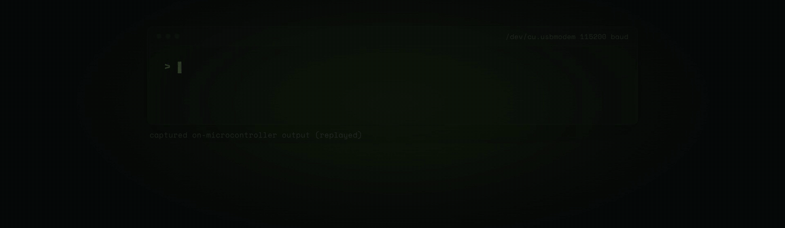

# Running a 28.9M parameter LLM on an $8 microcontroller

<p align="center">
  Open to Work &nbsp;·&nbsp;
  <a href="https://x.com/slvDev">𝕏 slvDev</a> &nbsp;·&nbsp;
  <a href="https://www.linkedin.com/in/slvdev/">LinkedIn</a>
</p>



This is a 28.9 million parameter language model that generates text on an ESP32-S3,
a microcontroller that costs about $8. It runs on the chip itself, with nothing
sent to a server, and it writes each word to a small screen wired to the chip at
roughly 9 tokens per second. The last language model people ran on a chip like this had 260
thousand parameters, so this one holds about a hundred times more. It fits because
most of the model lives in flash instead of RAM, using an idea from Google's Gemma
models called Per-Layer Embeddings.

## The numbers

|              |                                                               |
| ------------ | ------------------------------------------------------------- |
| Parameters   | 28.9M stored (25M of them in a flash lookup table)            |
| Chip         | ESP32-S3, about $8, with 512KB SRAM, 8MB PSRAM and 16MB flash |
| Speed        | about 9.5 tok/s end to end (9.7 tok/s of pure compute)        |
| Connectivity | none, everything runs on the device                           |
| Model size   | 14.9MB at 4-bit                                               |

## Why it is hard, and how it fits anyway

A microcontroller has very little fast memory. The ESP32-S3 gives you 512KB of SRAM.
Normally the whole model has to be reachable from there, which keeps you stuck with
tiny models, and that is why the previous model on a chip like this had only 260
thousand parameters.

The way around it is to stop putting the model in fast memory at all. Most of a
language model's parameters sit in an embedding table, which the model reads from
rather than computes on. So you can leave that 25 million row table in slow flash
and pull only the few rows each token needs, about 450 bytes, while the small part
that does the actual work stays in fast memory. The large model then costs almost
nothing to run, because you never load most of it. It just sits in flash and gets
sampled a little at a time.

That idea is Google's Per-Layer Embeddings, from Gemma 3n and Gemma 4. Here it runs
on the memory layout of a microcontroller instead of a phone or a GPU. As far as I
can tell, nobody had tried it on a chip this small.

```
  SRAM  (fast, tiny)   the "thinking" core, used on every token
  PSRAM (medium)       the output head and working memory
  FLASH (huge, slow)   the 25M-param table, about 6 rows read per token (~450 B)
```

## What it does, and what it does not

The model was trained on TinyStories, so it writes short, simple stories and mostly
keeps them coherent. It will not answer questions, follow instructions, write code,
or know facts. That limit comes from the small part of the model that does the
reasoning, and the memory trick does not change it. What is interesting here is the
architecture, fitting a large model onto a tiny chip, rather than what a 28.9 million
parameter model can say.

## Chạy trên nền tảng nào

Model đã train **được commit sẵn** trong [`firmware/model/`](firmware/model/README.md)
(1.87 MB, 4-bit) cùng `golden.txt`, nên clone về là kiểm chứng được ngay, không cần
train lại. Lưu ý bản commit sẵn là cấu hình nhỏ 3.6M để lặp nhanh, **không phải** bản
28.9M ở RESULTS.md — khác biệt liệt kê đầy đủ trong
[`firmware/model/README.md`](firmware/model/README.md).

| Nền tảng | Train / export (PyTorch) | Runtime C/CUDA | Trạng thái |
|---|---|---|---|
| **x86-64 Linux** | `uv run` — CPU hoặc CUDA | `host_verify`, `samples/cpu` (AVX2) | đã đo, xem bảng thang tối ưu dưới |
| **macOS Apple Silicon** (M1–M4) | `uv run` — **MPS**, không cần cài gì thêm | `host_verify`, `samples/cpu` (NEON+dotprod) | đã đo trên M3, xem ghi chú bên dưới |
| **NVIDIA Jetson** (Orin, Orin Nano Super) | `firmware/jetson/run.sh` (Docker) hoặc `uv run` thẳng | `firmware/jetson` (CUDA, `ARCH` tự dò) | xem [`JETSON.md`](firmware/jetson/JETSON.md) |
| **ESP32-S3** | không train trên board | `firmware/esp32_llm` (Xtensa LX7) | xem [README của firmware](firmware/esp32_llm/README.md) |

Một lệnh kiểm chứng, giống hệt nhau trên cả bốn:

```bash
make -C firmware/host_verify verify     # PASS: C matches PyTorch golden
```

`src/train.py` tự chọn thiết bị theo thứ tự **MPS → CUDA → CPU**, nên toàn bộ đường
train/export chạy native trên Mac Apple Silicon; không cần Docker, không cần GPU
NVIDIA. Đo thật: train cấu hình 4096/2000-bước hết 21,3 phút trên M3.

**macOS cần biết hai chỗ:** `uname -m` trên đây trả về `arm64` chứ không phải
`aarch64`, và Apple clang không nhận `-fopenmp` trần (cần `brew install libomp`).
Cả hai đã được [`samples/cpu/Makefile`](samples/cpu/Makefile) tự dò và xử lý — thiếu
libomp thì nó vẫn build, chỉ chạy 1 luồng và nói rõ điều đó.

## Running it yourself

The firmware, the wiring, and the flashing steps live in
[`firmware/esp32_llm/README.md`](firmware/esp32_llm/README.md). The training,
ablation, and quantization code is in `src/` and `experiments/`. The full method,
the ablations, and the on-chip measurements are written up in
[`RESULTS.md`](RESULTS.md).

## Also runs on: NVIDIA Jetson (CUDA)

[`firmware/jetson/`](firmware/jetson/JETSON.md) is a third runtime target. It reads
the **same** `model.bin` that `src/export.py` writes and the ESP32 flashes, reuses
`llm_load()` from [`firmware/common/llm.h`](firmware/common/llm.h) verbatim, and is
checked against the **same** `golden.txt`. Only the arithmetic moves to the GPU.

```
src/export.py ──> firmware/model/model.bin ──┬──> esp32_llm/     Xtensa LX7, scalar C
                  firmware/model/golden.txt  ├──> host_verify/   CPU, scalar C
                                             └──> jetson/        Ampere GPU, CUDA
```

The whole PyTorch pipeline runs in a container (nothing installed on the host):

```bash
./firmware/jetson/run.sh build      # image from pytorch/pytorch
./firmware/jetson/run.sh prepare    # TinyStories -> BPE -> token bins
./firmware/jetson/run.sh train      # train the `ple` arm
./firmware/jetson/run.sh export     # -> firmware/model/{model.bin,golden.txt}

cd firmware/jetson && make verify   # golden check on the GPU
                      make bench    # tok/s + per-stage roofline diagnosis
```

One artifact, three runtimes, one golden reference. The port exists to make the
memory-hierarchy argument measurable on hardware where it *doesn't* apply — on the
ESP32 the head is bandwidth-bound, while on Orin the model is small enough that
kernel-launch overhead dominates instead. Same model, different bottleneck; that
contrast is the point.

- [`DEPLOY.md`](DEPLOY.md) — architecture diagrams, tensor tables, the `model.bin`
  byte layout, and step-by-step deploy + test on both a laptop GPU and a Jetson,
  with reference numbers for every stage.
- [`firmware/jetson/JETSON.md`](firmware/jetson/JETSON.md) — kernel design, the
  float-associativity caveat, measured results, and exercises.

## Learning the optimisation, across architectures

[`docs/`](docs/README.md) is a course built on this repo, using the fact that the
*same* `model.bin` runs on three architectures — MCU, CPU, GPU — as a bench for
learning what transfers between them and what does not.

[`samples/cpu/matvec_ladder.c`](samples/cpu/matvec_ladder.c) is the centrepiece: it
runs one operation (the output head) through the same five optimisation steps the
ESP32 log in `RESULTS.md` went through, on x86 and on ARM, and measures each. Same
code, same weights, different machines — and the ladder does not rank the same way:

| step | x86 (AVX2) | ARM Cortex-A78 (NEON) |
|---|---:|---:|
| int8 staged (unpack once) | 8.3× | 13.7× |
| + hand-written SIMD | 12.4× | **13.3× — no gain** |
| + threads | **76.8×** | 55.4× |

Hand SIMD pays on x86 and buys nothing on ARM, because gcc already auto-vectorised
the scalar loop there. The sample also calibrates thread-launch cost at runtime and
finds that on a hybrid P-core/E-core CPU, using every logical core is 700× *slower*
than using eight. Neither result is guessable; both are one `make` away.

Hai cột trên đo trên output head của model **28.9M** (`[32768 x 96]`). Chạy cùng
lệnh với `model.bin` commit sẵn trong repo thì head chỉ còn `[4096 x 128]` — nhỏ hơn
8 lần — nên **các con số không so trực tiếp được**. Ví dụ trên MacBook Pro M3 với
head nhỏ đó: int8 staged 12.9×, +NEON 22.6×, nhưng **+threads tụt xuống 14.5×** vì
việc mỗi lần gọi (13,5 us) chưa đủ trả cho chi phí mở vùng song song (13,3 us). Cùng
bài học với cột ARM, chỉ đến từ một hướng khác: song song có giá cố định, và giá đó
phải so với kích thước công việc chứ không so với số lõi.

```bash
make -C samples/cpu run
```

## Credit

TinyStories is the dataset this trains on: short synthetic stories simple enough
that a small model can still learn to write coherently (Ronen Eldan and Yuanzhi Li,
Microsoft Research, [arXiv:2305.07759](https://arxiv.org/abs/2305.07759)). The other
half is Per-Layer Embeddings, Google's design from the Gemma models, which is what
lets a big model fit on a small chip.

Andrej Karpathy's [llama2.c](https://github.com/karpathy/llama2.c) is why a lot of
people, me included, believe you can train a tiny language model and run it in plain
C at all. This grew out of that.

## How this actually went

I left the messy history in the repo on purpose. That includes a bug I found in my
own parameter accounting, which had inflated an early number, and the corrected
result that followed once I fixed it. The commit history and `RESULTS.md` show where
the numbers moved and why.
